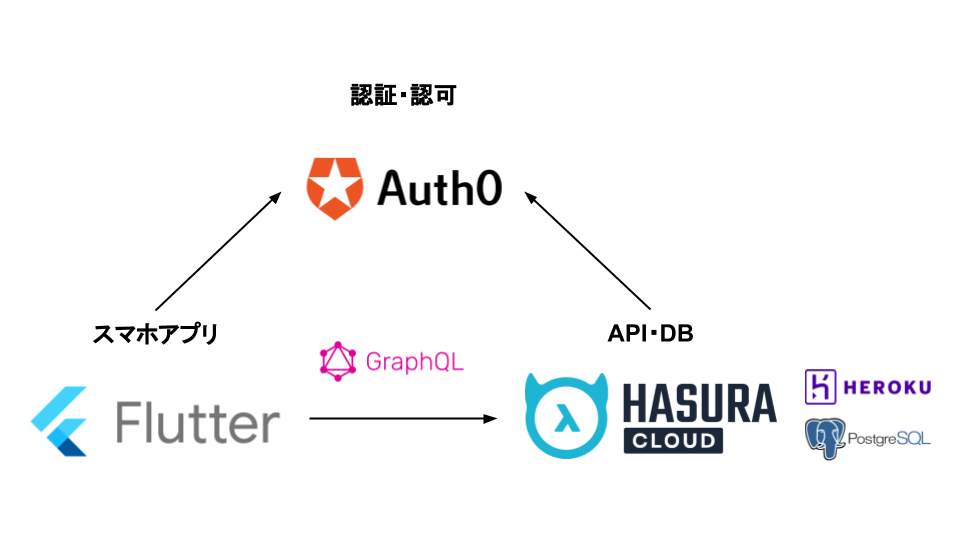
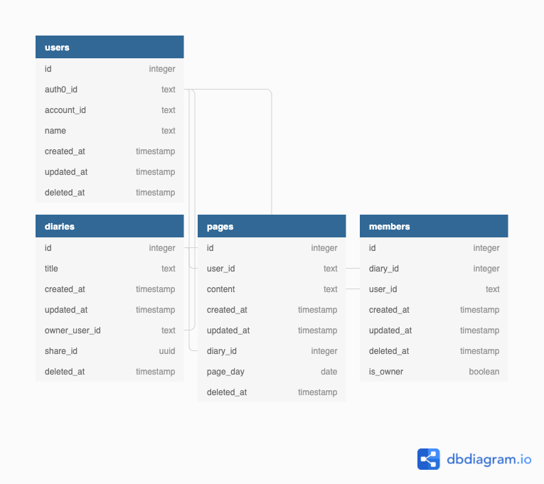

## はじめに

先日、家族や友人、恋人と共有できる日記アプリ「[ShareDiary（シェアダイアリー）](https://sharediary.konnyaku256.dev/)」を公開しました。



この投稿では「ShareDiary」を公開するまでに考えたこと、やったことを振り返ります。

## きっかけ
妻と話しているとき、「2人だけの日記があったらいいな」という話になりました。

何かいいサービスはないかと思い、ネットで「日記」「交換日記」のようなキーワードで探してみました。
家族向けの日記アプリなどいくつかのサービスがヒットしましたが、いまいちピンと来るものがみつかりませんでした。

そこで、ゼロから作ることにしました。
サービス名は共有できる日記なので、「ShareDiary（シェアダイアリー）」としました。

## 要件をまとめる
このサービスの要件をまとめました。

- ユーザーは日記を作成できる
- ユーザーは日記に参加できる
- ユーザーは参加している日記にページを書ける
- ユーザーは参加している日記のページを閲覧できる

基本的にはTwitterのような使用感（ユーザーやツイート、タイムラインのような概念があること）をイメージしつつ、「ShareDiary」では（ツイートの代わりに）日記やページが特定の人にだけ公開できるようなものを考えました。

## プラットフォームを決める
このサービスをどのプラットフォームで展開すれば良いか考えました。

ざっと次のプラットフォームを候補に上げました。
- Web
    - Mobile
    - PC
- Mobile
    - Android
    - iOS
- PC
    - Windows
    - macOS
    - Linux

日記を書く人の視点になると「書くモチベーションを如何に維持できるか」は重要そうです。
日記を書くために、毎日PCを開いたり、PCやスマホのブラウザを開いたりするのは面倒です。

そのため、スマホアプリとして作ることにしました。[^プラットフォームについて]

## デザインする
ShareDiaryを使う人のユーザーストーリーを考えながら、Figmaを使ってモックアップを作成しました。

このとき、画面上のコンポーネントやその配置もある程度固めました。

## 技術選定
要件やプラットフォームが決まったので、どのような技術を用いて開発すればよいか、技術選定をしました。

### クライアントサイド
まず、スマホアプリをどう開発するかですが、パッと次の候補を検討しました。[^ネイティブ]

- ネイティブ
    - Kotlin
    - Swift
- クロスプラットフォーム
    - Flutter
    - React Native
    - Kotlin Multiplatform Mobile
    - .NET Multi-platform App UI

ネイティブであれば、ハードウェアのAPIを直接利用できるため、画面のレンダリングやカメラなどの物理デバイスを扱うのに最適化した実装ができそうです。ただし、Android、iOSでそれぞれ別の実装をする必要があります。

クロスプラットフォームであれば、画面のレンダリングは開発ツール側がうまいことやってくれるので、単一のコードベースでほぼ同じUIの実装が可能です。ただし、最新OSへの対応は開発ツール側やサードパーティーのライブラリによるサポートを待つか、自作する必要があります。

比較した項目を表にするとこんな感じです。

|開発方式|開発・運用効率|パフォーマンス|端末固有機能|最新OS対応|
|-|-|-|-|-|
|ネイティブ|△|◎|◎|◎|
|クロスプラットフォーム|◎|◯|◯|△|

「ShareDiary」では
- 要件的にAndroidやiOS標準の機能しか使用しないこと
- できれば、Android、iOS両対応で作りたい
- 個人開発なので人的リソースが1人

という条件から開発・運用効率を重視して、クロスプラットフォームでの開発を選択しました。

次に、クロスプラットフォーム開発でどのツールを使うか決めました。

検討した開発ツールを表にするとこんな感じです。

|開発ツール名|開発言語|対応プラットフォーム|UIの描画方式|ライブラリ|
|-|-|-|-|-|
|Flutter|Dart|Android, iOS, Web, Windows, macOS, Linux, 組み込み|独自|https://pub.dev/ から入手可能|
|React Native|React|Android, iOS|ネイティブ|npmレジストリから入手可能
|Kotlin Multiplatform Mobile|Kotlin|Android, iOS|ネイティブ|Kotlin製のライブラリが使用可能
|.NET Multi-platform App UI|C#, F#|Android, iOS, Windows, macOS, Linux, Tizen|独自|NuGet で入手可能

「ShareDiary」では
- できるだけ手間をかけずに開発したい
- どのプラットフォームでも統一された見た目にしたい

という条件から、学習コストが低いこと[^個人的な見解]、ライブラリが充実していること、UIの描画方式が独自であることを重視して、Flutterを選択しました。

以上から、Flutterを使ってAndroid, iOS向けにクロスプラットフォーム開発することにしました。

### サーバーサイド
続いてサーバーサイドの技術選定をしました。

#### 認証・認可
「ShareDiary」にはユーザーの概念があり、特定のユーザーのみ操作可能にしたいリソースがあります。
そのため、認証・認可の仕組みが必要です。
この仕組みを自前で実装するのは工数的に大変ですし、自前で実装したとしてもセキュリティ上のリスクが怖いです。
そこで、サードパーティの認証・認可サービスを使うことにしました。
料金体系に無料プランがあるもの、認証方式にJSON Web Tokenをサポートしているものとして以下を検討しました。

- Auth0
- Firebase Authentication
- AWS Cognito

また、認証・認可サービス側で作成されたユーザー情報をサービス本体側と紐付けられるようにするため、後述するDBのユーザーテーブルと同期できるようにする必要がありました。

Auth0にはRulesという任意のJavaScript関数を実行できる機能があり、無料プランでも使用することができるため、Auth0を使用することにしました。

#### API・DB
ユーザーや日記、ページなどのデータを保持するためのデータベースとそのデータを操作するためのAPIをどのように開発するか検討しました。

次のような項目を考えました。

- API
    - Interface
        - RESTful API
        - GraphQL
    - Server-side Application
        - Go
        - PHP
        - etc.
- DB
    - RDBMS
        - MySQL
        - PostgresQL
    - NoSQL
        - MongoDB 
- BaaS
    - Firebase

クライアントサイドからの扱いやすさを考えると、APIはGraphQLで提供できるとかなり楽ができそうです。
ただし、GraphQLを使う場合、普通に実装しようとするとサーバーサイドアプリケーション側で膨大かつ煩雑なGraphQLのリゾルバを実装する必要が出てくるため、1人で開発するのは現実的ではありません。
また、どんなインターフェースで実装する場合であっても、APIやDBサーバーをイチから構築したり、それらを動かすインフラを用意するのはかなりの工数がかかります。

このような懸念点を考慮するとFirebaseはとてもよい選択肢に思えます。
しかし、FirestoreではRDBを使うことができず、Firestore独自のコレクションやドキュメントといった形式でデータ構造を定義する必要があります。
また、データの操作もクライアントのプラットフォームごとに用意された専用のSDKを介して実装する必要がありちょっと扱いにくい印象です。

そこで、いろいろ調べた結果、とても素晴らしいソリューションに出会いました。
[Hasura GraphQL Engine](https://hasura.io/)です。

Hasura GraphQL Engineとは、かんたんに言うと、RDBのスキーマを解析して、データの作成・読取・更新・削除に関する操作が実装されたGraphQLサーバーを自動生成してくれるツールです。
Hasuraを使えば、扱いたいテーブルとそのリレーションを定義するだけで、そのデータを操作可能なGraphQL APIを作ることができるのです。

また、HasuraにはHasura Cloudという専用のクラウドサービスがあり、アカウント登録するだけですぐに使うことができます。
DBは外部のサーバーを指定して接続できるようになっていて、HerokuのPostgresQLインスタンスであれば完全無料で使えます。

以上を踏まえて、Hasura Cloudを使うことにしました。

### 全体構成図
もろもろ検討した結果、次のような構成図にまとまりました。



## DB設計
次のER図に示すようなテーブル設計にしました。
テーブル定義はHasura Cloudのコンソール上からGUIでポチポチするだけでできてしまうので、わざわざSQLを書く必要はありませんでした。



## Flutterのライブラリ選定
Flutterで導入するライブラリを選定しました。
選定理由は書くと長くなってしまうので、割愛します。

主に導入したライブラリは次の通りです。

- Auth0 Client
    - flutter_appauth
- GraphQL Client
    - Ferry
- フィーチャーフラグ（メンテナンス中かどうかの切り替え）
    - flagsmith
- Hooks
    - flutter_hooks
- DI
    - get_it
    - provider
- 無限スクロール
    - infinite_scroll_pagination
- WebView
    - webview_flutter
- 多言語対応
    - flutter_localizations
- アプリアイコンの設定
    - flutter_launcher_icons
- パッケージ情報の取得
    - package_info_plus
- Flavor（環境ごとにアプリ名などを出し分け）
    - flutter_flavorizr


pubspec.yamlから一部抜粋します。
```yaml
dependencies:
  flutter:
    sdk: flutter
  flutter_localizations:
    sdk: flutter
  intl: "^0.17.0"
  package_info_plus: ^1.4.0
  http: ^0.13.4
  flutter_appauth: ^2.1.0+1
  flutter_secure_storage: ^5.0.2
  flutter_dotenv: ^5.0.2
  shared_preferences: ^2.0.11
  flutter_hooks: ^0.18.1
  provider: ^6.0.2
  infinite_scroll_pagination: ^3.1.0
  ferry: ^0.10.2+2
  ferry_flutter: ^0.5.4
  gql_http_link: ^0.4.0
  hive: ^2.0.4
  hive_flutter: ^1.1.0
  ferry_hive_store: ^0.4.2
  get_it: ^7.2.0
  graphql_flutter: ^5.0.0
  webview_flutter: ^3.0.0
  flagsmith: ^2.2.0-beta.1

dev_dependencies:
  flutter_test:
    sdk: flutter
  ferry_generator: ^0.4.4
  build_runner: ^2.1.5
  flutter_launcher_icons: ^0.9.2
  flutter_flavorizr: ^2.1.2
```

## 実装する
ごりごりと実装していきました。

新しい機能を作るときの流れは次のような感じです。

1. Hasura Cloudのコンソール上からテーブル定義を追加
2. Hasura CloudからGraphQLのスキーマをダウンロード
3. Ferry GeneratorでGraphQLスキーマからFerryクライアントのコードを生成
4. 生成されたコードを使って「日記を作成」などの画面を作る

やることはとてもシンプルでサーバーサイドでは基本的にテーブルを定義するだけでよく、クライアントサイドの開発に集中できました。

### 実装に関して参考にした記事
- https://auth0.com/blog/get-started-with-flutter-authentication/
- https://auth0.com/blog/building-a-collaborative-todo-app-with-realtime-graphql-using-hasura/
- https://hasura.io/learn/graphql/flutter-graphql/introduction/
- https://ferrygraphql.com/docs/

## 公式サイトを作る
Next.js on Vercelでさくっと作りました。

トップページに加えて、プライバシーポリシーと利用規約のページを作りました。
アプリストアへ公開する際、プライバシーポリシーや利用規約のリンクを求めれるため、そのための布石です。

プライバシーポリシーや利用規約をイチから作るのは手間なので、[App Privacy Policy Generator](https://app-privacy-policy-generator.firebaseapp.com/)というサービスを使っていい感じに自動生成・整形したものを使いました。


## アプリストアへ公開する
### リリースビルド
ストア公開用にリリースビルドを行いました。

内容としてはアプリアイコンを公開用に調整したり、証明書を準備したり、ググりながら進めました。

リリースビルドの設定が整ったら、[Codemagic](https://codemagic.io/start/)というCI/CDサービスを導入して、ストア公開用のバイナリを自動でビルドして自動で公開できるようにしました。

### Apple Developer Programの登録
App Storeでアプリを公開するには、Apple Developer Programの登録が必要です。
Apple IDと登録料の12,980円/年が必要です。

これをしないとアプリを公開できないので、黙って対応しました。

支払いが完了されてから承認されるまで48時間かかるそうです。
承認後、App Store Connectが使えるようになりました。

### Google Play Developerの登録
Play Storeでアプリを公開するには、Google Play Developerの登録が必要です。
Googleアカウントと登録料の3,110円（25ドル）が必要です。
こちらは初回登録料のみです。

これをしないとアプリを公開できないので、黙って対応しました。

こちらはとくに審査はなく、支払い完了後すぐにGoogle Play Consoleが使えるようになりました。

### App Storeへ公開する
App Store Connectからアプリの情報やアプリ画面のスクリーンショットを中心に必要な項目をググりながら埋めました。

1日程度で審査が完了し、公開の準備が整いました。
Android版と同時にリリースしたかったため、審査完了後、手動で公開できるようにしておきました。

### Play Storeへ公開する
Google Play Consoleからアプリの情報やアプリ画面のスクリーンショットを中心に必要な項目をググりながら埋めました。

3日程度で審査が完了し、公開の準備が整いました。
iOS版と同時にリリースしたかったため、審査完了後、手動で公開できるようにしておきました。

### 公開ボタンを押す
App Store Connect、Google Play Consoleそれぞれの公開ボタンを押して、無事公開です。

## かかった費用
Apple Developer Programの登録料：12,980円
Google Play Developerの登録料：3,110円

合計で16,090円でした。

サーバーやソフトウェアなどはすべて無料で開発することができたので、かなり出費を抑えることができました。[^かかった費用]

## おわりに
以上、個人開発でスマホアプリを作った話でした。
やりたいことが多かった割にはFlutterやHasuraなどの技術に助けられ、かなり楽をできたかなと思います。
どなたかの参考になれば幸いです。

## PR
そして、気が向いたらぜひ「ShareDiary」を使ってみてください。
フィードバックお待ちしています。（宣伝）

**Android版**
https://play.google.com/store/apps/details?id=com.konnyaku256.sharediary

**iOS版**
https://apps.apple.com/us/app/sharediary-%E3%82%B7%E3%82%A7%E3%82%A2%E3%83%80%E3%82%A4%E3%82%A2%E3%83%AA%E3%83%BC/id1616517319?platform=iphone

[^プラットフォームについて]: 個人的に、いつかスマホアプリを作ってみたいと思っていたのでよい機会になりました。
[^ネイティブ]: JavaやObjective-Cは昨今のトレンドではないと思うので除外しました。
[^個人的な見解]: 個人的な見解です。
[^かかった費用]: とはいえ、Appleのほうは毎年この料金がかかるのでかなり高い...。