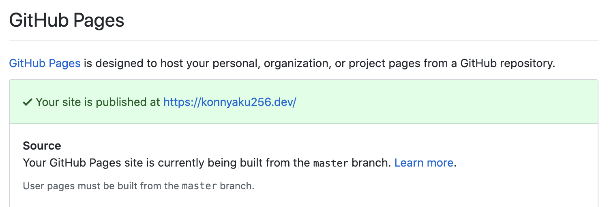

## GitHub Pages について

[GitHub Pages](https://pages.github.com/) とは GitHub が提供している Website のホスティングサービスです。
リポジトリに静的ファイルを設置することで GitHub repository のプロジェクトページをかんたんに公開することができます。
通常ドメインは username.github.io でカスタムドメインも設定できます。

### Project site

プロジェクトサイト (username.github.io/repository_name)の場合、リポジトリの master ブランチまたは master ブランチの docs 以下を公開ソースとして設定し、そこに静的ファイルを置くだけで公開できます。
また、gh-pages というブランチを切ることでそのブランチを公開ソースとすることもできます。（下図を参照）

### User/Organization site

ユーザサイト(username.github.io)の場合、username.github.io というリポジトリを使って公開できます。
こちらは master ブランチに静的ファイルを置いて公開する必要があり、project site と違ってそれ以外のブランチやディレクトリで公開することはできません。（下図を参照）

## 解決方法

上記の仕様に従うとユーザサイトを作る場合は開発ブランチを別で切る必要があり、コード管理が煩雑になりがちです。
そこで、リポジトリの運用方法を少し工夫することでこの問題を解決することができます。
自分が実践している運用方法を紹介しているので、ひとつの例として見てもらえると嬉しいです。

自分の場合は、以下のように 

- 開発リポジトリ: https://github.com/konnyaku256/portfolio
- 公開リポジトリ: https://github.com/konnyaku256/konnyaku256.github.io

を別に分けて運用しています。

基本的に開発コードは portfolio で管理をしていて、公開するときは
Circle CI で portfolio の master へのマージをフックしてビルドし、できあがった静的ファイルを konnyaku256.github.io の master に push するようにしています。

このようにすれば、GitHub Pages の仕様に縛られることなく自由に開発することができ、開発リポジトリにビルドしたファイルを置く必要もなくなります。

けっこう前から実践している運用方法ですが、個人的にしっくりきているため誰かの参考になれば嬉しいです。
