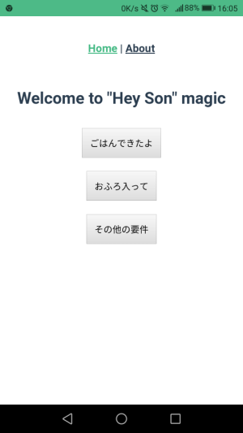

## はじめに
新成人のみなさん、おめでとうございます！[@konnyaku256](https://twitter.com/konnyaku256)です。
私は去年がそうだったので1年前が懐かしいです。
今年はというと、せっかくおめでたい日だし何かしよう！ということで以下のような取り組みをしており



と意気込んでいましたが、、、



後回しになってしまっていました。

本ブログも無事に開設でき、チューニングも完了してやっと執筆できた次第です。


## 成人式ハッカソンとは？
成人式ハッカソンとは「IT技術を駆使して親孝行！をテーマに成人の日に行うハッカソン」です。
命名は特にひねらず、これから成人になる人や成人になって間もない人が作るものにふさわしいテーマにしました。
今回は実家に引きこもって1人でやってみました。

## 作ったもの / Hey Son
<a href="https://github.com/konnyaku256/hey-son"></a>



### What is "Hey Son"?
Hey Sonはおかあさんのための息子を呼び出す魔法です。

あなたはいつも息子を呼ぶときどうしていますか？ 階段を登って、廊下を歩いて、息子の部屋まで呼びに行っていませんか？

それって、ちょっと面倒ですよね。 この魔法を使えばそんな悩みをかんたんに解決できます。

### How to use
このWebアプリを開いてボタンを押すだけです。 たったこれだけで、あなたの息子を呼び出せます。

### How magic works
このアプリは息子の部屋のRaspberry Piとつながっています。 ボタンが押されたら、Raspberry Piに接続されたスピーカーから呼び出しが掛かるようになっています。

## Architecture


## Features
### Frontend
Hey Son Web client
- Vue.js
- axios

### Backend
Audio playback API server
- Golang
- [Command] aplay, alsa-utils

### Hardware
- Raspberry Pi 4 model B / 4GB(RAM)
- Logitech Z120 Mini Stereo Speakers

## 工夫したこと
- Frontend/BackendのDockerコンテナはマルチステージビルドを使用して軽量化
- 今回のアーキテクチャだとCORSの問題が発生するのでAudio playback APIのHTTPレスポンスヘッダにアクセルコントロールの設定を追加
- GolangからRaspberry Piに接続されたスピーカへ音を鳴らすために標準モジュールのos/exec、`aplay`コマンドを使用(Raspbianの標準サウンドシステムALSAを利用するため)

## 得られた知見
今回のシステムではオーディオ再生命令を担当するプログラムがDockerコンテナ側で動いているため、通常ホストマシン本体の音を鳴らすことができません。
そこで、いろいろ調べてみると、Raspbianには標準でALSA(Advanced Linux Sound Architecture)と呼ばれるサウンドシステムがあるようで、今回のような要件はDockerコンテナのオプションで`--device /dev/snd`を追加すれば実現できることがわかりました。
実際にはdocker-compose.ymlの対応するサービスの部分に以下のオプションを追加したところ、見事に音が鳴りました。
```docker-compose.yml
...
devices:
  - "/dev/snd"
...
```
参考リンク: https://github.com/mviereck/x11docker/wiki/Container-sound:-ALSA-or-Pulseaudio

## おわりに
僕の母に実際に使ってみてもらったところ、「便利！面白い！」という反応をもらえました。
手元にいい感じのセンサーがなくて作れるものが限られてはいましたが、テーマに沿ったものができてよかったです。

もう成人になってしまった人もこれから成人になる予定の人も次の成人式が暇だったらこの「成人式ハッカソン」をやってみてはいかがでしょうか。
きっと面白い開発体験が待っていると思います。

流行れ、成人式ハッカソン！！！