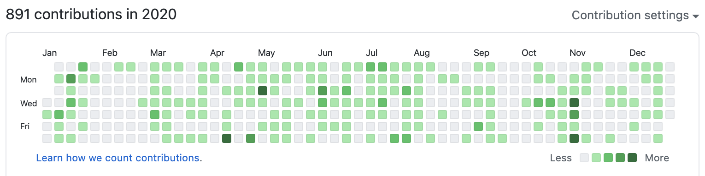
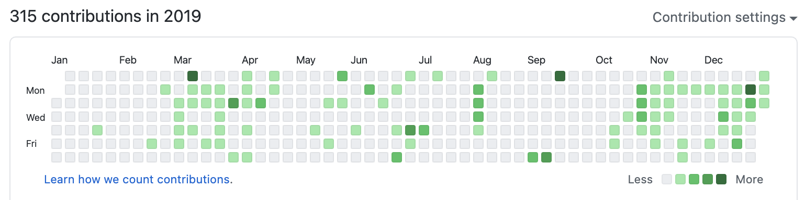

こんにちは、[@konnyaku256](https://twitter.com/konnyaku256)です。
[去年の投稿](https://medium.com/@konnyaku256/2019%E5%B9%B4%E3%82%92%E6%8C%AF%E3%82%8A%E8%BF%94%E3%82%8B-e8c050cd92ce)に引き続き今年もゆるめに振り返ってみたいと思います。

## 個人ブログの開設
2020年に入ってすぐ、当方の誕生日を記念してこのブログ「[こんにゃくの日記](https://blog.konnyaku256.dev/)」を開設しました。本数全然書けてないですが、もうじき1周年を迎えます！:tada:
Hugo + Netlify な構成でブログのソースコードやコンテンツをGitHubで管理できるようにしました。この辺は[@p1ass](https://twitter.com/p1ass)くんの[ぷらすのブログ](https://blog.p1ass.com/)にけっこう影響を受けました。
開設時に書いた記事：[Welcome to my new blog !](https://blog.konnyaku256.dev/posts/welcome/)

完全自作ブログとまではいかないですが、かなり自由度高くコードベースでコンテンツをいじいじできるようになったので、個人的に満足できる個人ブログ執筆環境を作ることができました。

## GitHubのようす

2019年の振り返りでは
> 来年はもっと草生やしてジャングルにするぞ！

とか書いてましたがジャングルほどにはなりませんでした。
とはいえ、コントリビューション数にして2倍以上と着実に草が生えるようになりました。
内訳は趣味開発、友人とのチーム開発、ハッカソン、個人ブログ、学校の演習課題、論文など多岐に渡りました。
あらゆることをGitHubで管理するようになった結果、GitHubという存在がより身近なものに、コードを書くだけでなく様々な開発者と交流する場になりました。
また、UI変更や新機能の追加といった更新情報にも自然と目がいくようになりました。やっぱりbeta版をいち早く試せるとわくわくします。

## 就活
[CyberAgent, Inc.](https://www.cyberagent.co.jp/)のサーバサイドエンジニアとして内定をいただき、2021年度の4月から新卒で働く予定です。

> 終わったら別で書く予定です。

て書いてましたが、何も書かずに終わってしまいました。
最終面接後、ちょうど誕生日の前日に担当の人事さんから内定の連絡が来て、飛び上がった記憶があります。とても嬉しい誕プレでした。

## 内定者バイト
6月〜8月の約2か月間、[OPENREC.tv](https://www.openrec.tv/)さんで内定者バイトさせていただきました。
自身初のフルリモートでの就業でしたが、今後直近のキャリアとしてテックリードを意識するようになったり、チーム開発におけるオンラインコミュニケーションでの立ち回りを工夫したりと、貴重な経験になりました。

## その他諸々の活動
ここからはだいたい時系列にさっくりと。

### aizu-go-kapro
会津大学さんで実施された下記のイベントに参加したことをきっかけに、会津大学の方々とGoでチーム開発する、ということをやってました。
https://zli.connpass.com/event/163395/

週1くらいのゆるいペースでちょっとずつ進めて、[keiGo](https://keigo.konnyaku256.dev/)という敬語変換サービスを開発しました。GitHubリポジトリは[こちら](https://github.com/aizu-go-kapro/keiGo)。

これまで他大学の方とチーム開発する機会はほとんどなかったので、IssueやPRベースの開発が勉強になりました。

### N-ISUCON
NTT Communicationsさんが社内向けに開催しているISUCONの学生版に参加しました。
https://nttcom.connpass.com/event/163460/

初めてのISUCON参加でしたが、競技後にチューニングの方針や具体的な手法の解説がありとても勉強になりました。
このイベントが2020年に参加した最後のオフライン技術イベントでした。


### おうちハッカソン
この時期は学校が臨時休業、外出自粛などであらゆる活動が厳しい時期でした。
そこで、ゴールデンウィークを活用してオンラインで「おうちハッカソン」に参加しました。
https://connpass.com/event/174573/

初のオンラインハッカソン参加でしたが、ゲームクライアントとサーバ間のリアルタイム通信にgRPCを採用するなど技術的な挑戦もできてとても有意義に過ごすことができました。


### うじまる生誕LT会
友人の[@uzimaru0000](https://twitter.com/uzimaru0000)くんの生誕LT会で登壇しました。
登壇に向けた開発を通して、Vercelやtailwindcssといった技術を学ぶきっかけにすることができました。
https://zli.connpass.com/event/176933/



### CA21ハッカソン
内定先の21卒同期でオンラインのハッカソンをしました。
同期とのチーム開発は新鮮でとても楽しむことができました。

### WIC Speed Hackathon Online
CyberAgentで社内向けに実施されているWebフロントエンドのパフォーマンス・チューニングイベントに参加させていただきました。
テーマは「架空のブログサイトを高速化する」というもので、webpackの設定、Reactコンポーネントの実装について学びました。

イベントで使用されたGitHubリポジトリは公開されているので興味のある方はのぞいてみてください。
https://github.com/CyberAgentHack/web-speed-hackathon-online

### CAMPHOR- LT 2020 Summer
京都の学生向けコミュニティ [CAMPHOR-](https://camph.net/) さん開催のLT会で登壇させていただきました。
https://camphor.connpass.com/event/182978/


### KOSEN セキュリティコンテスト 2020
2019に引き続き、学校の後輩と一緒に出場しました。
それなりに好成績を残すことができました。


### p1ass生誕LT会
友人の[@p1ass](https://twitter.com/p1ass)くんの生誕LT会で登壇しました。
生誕LT会の流れが来てていいですね。とても盛り上がるのでおすすめです。
https://connpass.com/event/193445/


### JPHACKS 2020
JPHACKSというハッカソンにチーム「蒟蒻畑」として出場し、家庭菜園支援アプリ「おしゃべじたぶる」を開発しました。
Award Dayに進出し、Best Team Collaboration Award など複数の賞をいただくことができました。


公式サイトでの結果発表：[「JPHACKS 2020 Award Day」結果ご報告](https://jphacks.com/information/result-report2020/)

そのときに書いた知見レポートがなかなか好評でした。


## 学生生活
今年度でもって、高専本科 5年制 + 専攻科 2年制の長かった学生生活もそろそろ終わりが近づいてきました。
大学と違って最後まで普通に必修の講義があるので気が抜けません。
そろそろ、卒業論文の締め切りが近づいてきたので現在はそれを鋭意執筆中という感じです。
発表予定だった学会が中止になってしまい、大きな学会で発表することは叶いませんでしたが、本科5年からの3年間、同じテーマで研究を続けられたのはとても良かったです。

## おわりに
いかがだったでしょうか。
僕がこの1年でやったきたことをさくっと知ってもらえていたら嬉しいです。

今年はご時世もあって、なかなかオフラインのイベントに参加することができませんでしたが、オンラインを中心に継続して活動できたことを嬉しく思います。
各種イベントを運営、ともに活動してくれたみなさまに感謝します。

来年もどうぞよろしくお願いいたします！

## P.S.
意外と振り返りまとめ書くの消耗したので、たぶん来年からはTwitterのモーメント使います。。。