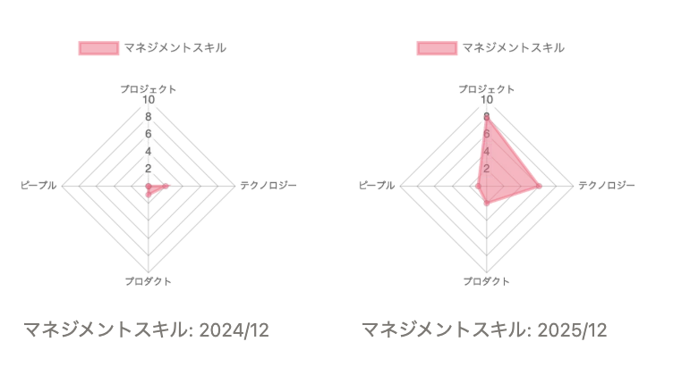

2024年12月に前職を退職し、2025年1月から株式会社ダイニーに入社しました。

https://blog.konnyaku256.dev/posts/quit-cyberagent/



早いもので、転職してからあっと言う間に1年が経過してしまいました。

また、先月には待望の第二子が誕生しました。



ありがたいことに職場の方々にはご理解いただけており、現在は育児休業を取得しています。👶💤

休業中に仕事はできませんが、考えを整理してアウトプットする時間は思ったより確保できそうです。
そこで、気分転換も兼ねて、私の「ソフトウェアエンジニア人生における現在地」を分析・言語化し、今後のキャリアパスについて考えます。

## 主な活動
主力プロダクト群のプロダクト開発、検証プロダクトの本開発を経て、直近は主力プロダクト群のプロダクト開発チームの技術リーダーを任されていました。
通算で 6 プロダクト、3 チームを渡り歩きました。
また、並行して新メンバーのメンター、採用候補者の方とのカジュアル面談も担当しました。

## 新たに獲得したスキル・経験
- 技術リーダーとしての
  - プロジェクトマネジメント
  - 設計レビュー
  - コードレビュー
- メンター
- カジュアル面談
- PC 操作を中心とした個人レベルの業務効率化
- AI によるコーディング

## 主な成長
私はジュニアレベルのソフトウェアエンジニアとして第二新卒で入社しました。（採用経路として第二新卒のような枠はありませんでしたが、経験年数を踏まえて便宜上第二新卒と呼称します）

前職では、実務経験を積み、任されたタスクをある程度の自走力を持って遂行できるレベルまで到達していました。
このレベルから、チームレベルのアウトプットに責任を負ったり、技術的な意思決定をリードしたりできるレベルまで成長できました。

マネジメントスキル変化の図

## 考察
なぜ1年という短期間でこのような成長ができたのか、それは「所属する組織の環境（開発体制、規模、文化）や上司となるマネージャーが自分に合っていたから」と考えています。

それぞれの要素を分析・言語化します。

- 開発体制
  - 四半期ごとに会社全体の事業戦略が見直されている
  - 組織的に大幅なチーム再編が発生しやすい
  - そのため、新しいことに挑戦できる機会が多くなりやすい
- 規模
  - プロダクト開発部門の頭数は 50 人程度（PdM, SWE, Designer, QA などの職種で構成）である
  - 1 人あたりの裁量が大きく、重要でやりごたえのある業務に出会える確率が高い
- 文化
  - 圧倒的な顧客志向
  - 顧客の声を重視するプロダクト開発文化が自分の性に合っていた
- マネージャー
  - アサインや目標設定が適切
  - 人を評価したり、組織の課題解決に注力したりしているレイヤーのメンバーが優秀であり、他メンバーから信頼されている

上記の要素が私個人の成長に与える影響は大きく、転職によってより自分に合っている企業に出会えたのは本当に幸運でした。

## 自分の強み
上長からの評価フィードバック内容を一部引用します。
> 「問題提起を行って他の人を巻き込み、議論をしていく中で組織を成長させていく」という部分で卓越した動きをしている

前職ではこのようなことに注力する機会は多くありませんでしたが、現職で技術リーダーを任されてからは特に意識していた点でした。

また、1年前の投稿には以下のようなことが書かれています。
> 開発・運用のフローやツールの改善では、要件を擦り合わせたり、関係各所と連携・調整したりとコードを書く以外のエンジニアとしての能力が求められ、最も苦労しました。この点については現在も苦手意識がありますが、今後の伸びしろとして特に注力したいと思っています。

正直なところ「コードを書く以外のエンジニアとしての能力」には自信がなかったのですが、チームリードやメンターなどの経験を通して、自信を持てるようになりました。

## 自分の弱み
技術力が他のエンジニアと比較して高くないと感じます。
一般的なプロダクト開発をする上での課題感はありませんが、込み入った技術仕様を考えたり、大規模な開発をしたりするときには足を引っ張る要因となりそうです。

## 今後のキャリアパス
この1年で「コードを書く以外のエンジニアとしての能力」についてはかなり高いレベルまで引き上げることができました。
この領域には今後も力を入れつつ、足元では「コードを書くエンジニアとしての能力」として技術設計やコードレビューの品質を中心に技術力の向上に注力したいです。
また、中長期的にはプロジェクトマネジメント、技術マネジメントのスキルツリーを解放していき、プロダクト開発を事業戦略レベルでより力強くリードできるようになりたいです。
