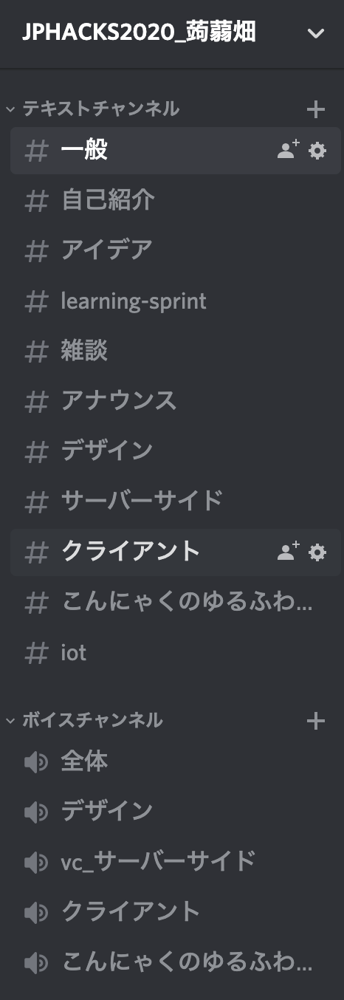
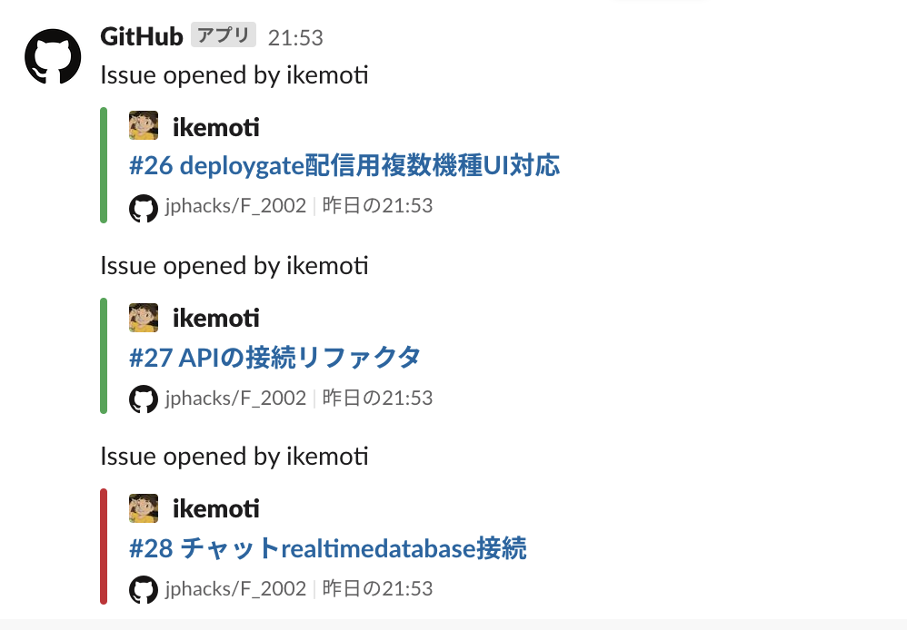
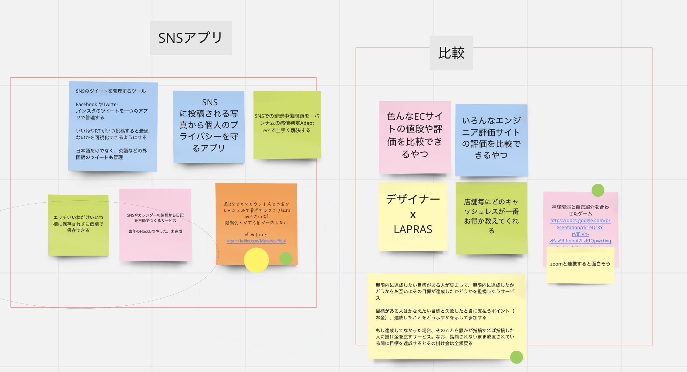
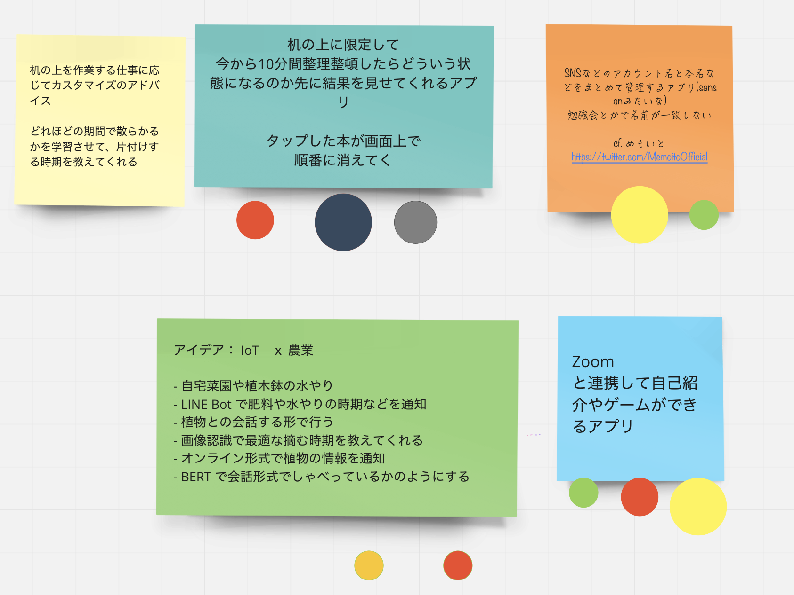
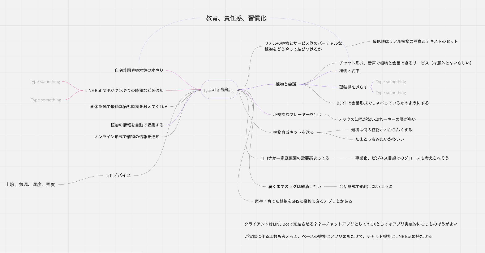
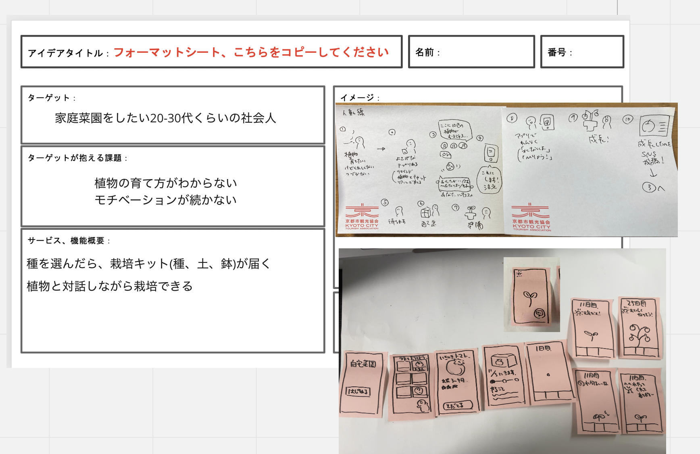
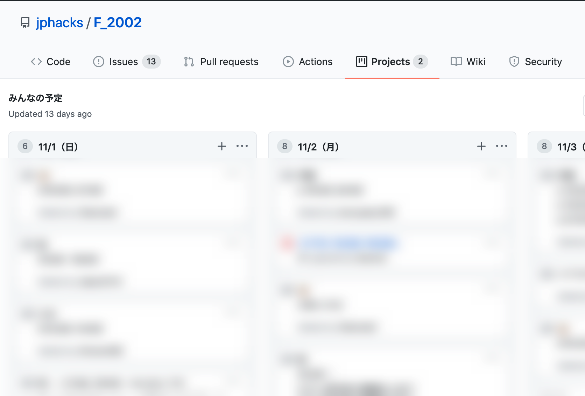
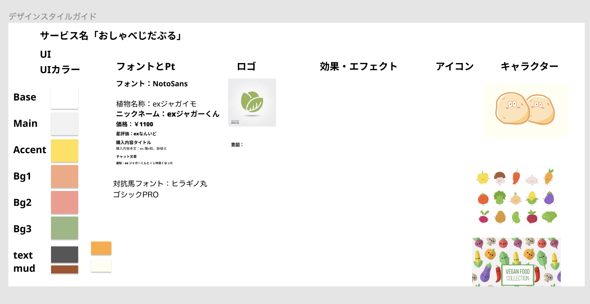
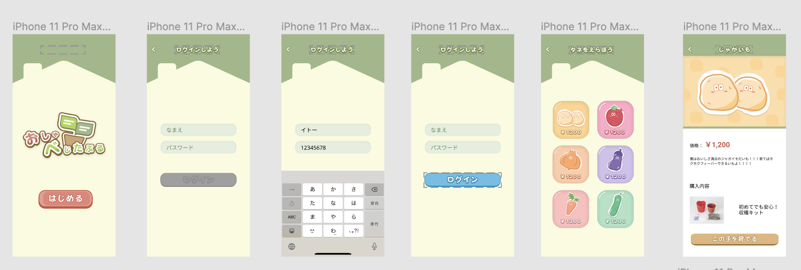

こんにちは、[@konnyaku256](https://twitter.com/konnyaku256) です。
先日、[JPHACKS 2020](https://jphacks.com/)というハッカソンがありまして、
私の参加したチーム「蒟蒻畑」は嬉しいことに参加者間投票でブロック2位（同票）を獲得することができました。

この投稿では、上記のハッカソンで実践した内容を振り返り、得られた知見についてまとめたいと思います。

成果物の詳細は下記のツイートからご覧ください。


## メンバー集め
Twitterでゆるめに募集しました。



当初はFF内で一緒に出てくれる人がいたらいいな〜くらいの感覚だったのですが、
人が人を呼び、計8人のメンバーが集まりました。

内訳は、担当した領域別に
- デザイナー x3
- iOSエンジニア x2
- サーバサイドエンジニア x3

のようになりました。

今回のハッカソンでは個人エントリーかチームエントリーのどちらかを選択できるようになっていたので、
事前にチームメンバーを集めた状態で初日を迎えられてとても心強かったです。

## コミュニケーションツールの導入
メンバーが集まったら全体のコミュニケーションツールとして、[Discord](https://discord.com/)を導入しました。
以降のミーティングや開発に関する議論はすべてこのDiscordに集約するようにしました。

テキスト/ボイスチャンネルは次のようなものを運用していました。

最初から全てのチャンネルがあったわけではなく、必要に応じて追加していく方針を取りました。

担当領域ごとに専用のチャンネルを作ってボイチャで集中的に議論できてとてもよかったです。

運営さんからご用意いただいたチーム用のSlackチャンネルはGitHubのサブスクBotとして活用させていただきました。

`/github subscribe` で簡単にGitHub上のイベントをSlackでかんたんに購読できます。
https://slack.github.com/

## アイデアソン
ハッカソン開始までの4日間に渡り、毎晩20:00〜2時間程度チームでアイデア出しを行いました。
事前にアイデアの本筋を固めておき、当日から開発開始できるように準備しておくこと、を目標にしていました。

アイデアソンでは[Miro](https://miro.com/)というサービスを使用しました。

最初はアイデアを発散させました。
ハッカソンのテーマはX-Tech（クロステック）と定められてはいましたが、ぶっちゃけ何作ってもいいみたいなテーマだったので、テーマを絞る作業からはじめました。
下記のようなポストイットに雑にアイデアを書いていき、ある程度出揃ったら似たようなアイデア同士をグループ化する、という作業を繰り返しました。


次にアイデアを収束させました。
アイデアソンの最終日に、出揃ったアイデアの中からそれぞれがいいと思ったものに投票しました。
投票の結果、下記の4つに絞り込まれました。

ここで、1つに絞ることができなかったので、テーマへの適合性、実現可能性を考慮して、「農業 x Tech」に決定しました。

あとはMiroの[Mind Map](https://miro.com/mind-map-software/)を使って、具体的にどんな要素を持たせるか議論していきました。

Mind Mapを使い始めた途端に良さげなアイデアがどんどん膨らんでいったのでおすすめです。

## ハッカソン
### プロダクトの共通認識
はじめに次のようなシートを埋めて、ターゲットやターゲットが抱える課題などを明確にしました。
サービス利用時の流れや必要そうなUIも列挙しました。

これによってチーム内で作りたいものの共通の認識を持つことができ、以降の開発で大きな手戻りや迷いなく進められたのがよかったです。

### 稼働日の共有
また、次のようなGitHub Projectsを立てて、各メンバーの稼働日を共有しました。
日付ごとのカラムを用意して、それぞれがその日の稼働ついてカードを書き込めるようにしました。

この使い方はこれまでしたことがなかったのですが、雑に稼働日を共有できてよかったなと思います。

### デザイン
[Figma](https://www.figma.com/)を使ってデザインスタイルガイドやUIデザインをまとめました。

デザイナーとエンジニア間でプロダクトのデザインとアプリのUIを共有するのがとても楽になり、デザインを見ながら実装に関する議論ができてよかったです。

### サーバサイドチームの工夫
私はサーバサイドの担当をしていたのでこの項目も少しだけ書いておきたいと思います。

#### OpenAPIの活用
API仕様書を[OpenAPI](https://swagger.io/specification/)で記述し、[Swagger UI](https://swagger.io/tools/swagger-ui/)を使ってサーバサイドAPIのドキュメントを共有できるようにしました。
また、[Postman](https://www.postman.com/)と連携してMockサーバを立て、リクエストのテスト実行をいつでも行えるようにしました。

サーバサイド側でロジックの実装が間に合っていなくても、クライアント側でAPIリクエストのテスト実行がしたいケースが多々あったのでとても便利でした。

#### Clean Architectureの採用
今回開発したプロダクトのサーバサイドアプリケーションアーキテクチャは[Clean Architecture](https://blog.cleancoder.com/uncle-bob/2012/08/13/the-clean-architecture.html)を採用しました。
導入時は良さげな設計パターンやメリットを全然理解できていませんでしたが、責務が分離されていることで各コードが担当している領域の見通しがよくなり、テストしやすい設計にすることができたと思います。（実際のところはまだテストコード全然書けてないです、すみません）

### 発表資料の準備
[Google Slides](https://www.google.com/slides/about/)でまとめていきました。
デザイン、開発上の工夫点はもちろん、サービスのペルソナや想定利用者へのヒアリング、リーンキャンバスや競合製品との差別化に関する調査結果の資料も含めました。

具体的にどのような事業効果が見込めるかまとめることができ、発表資料としての完成度を高めることができたと思います。

## 感想
**Miro x Figma x GitHub x Discord はオンラインハッカソンにて最強！** ということがよくわかりました。
完全オンラインだとチーム内でどうコミュニケーションをとるかが難しいところですが、上記で挙げたようなツールを活用することで
それらの問題をすべて吹き飛ばすことができたと思います。

また、チームメンバーがみんなつよつよで議論もしやすく、技術的に詰まることもほとんどなかったのがすごかったです。
プロジェクト管理上至らなかった部分もメンバーの協力にとても助けられました。みんなありがとう！

また、先日のオンライン審査の結果、弊チームはJPHACKS2020 Award Dayに進出できることになりました。
入賞目指して引き続き開発を進めたいと思います！


ではまた :wave:

